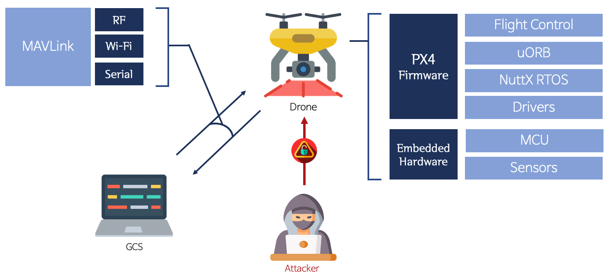
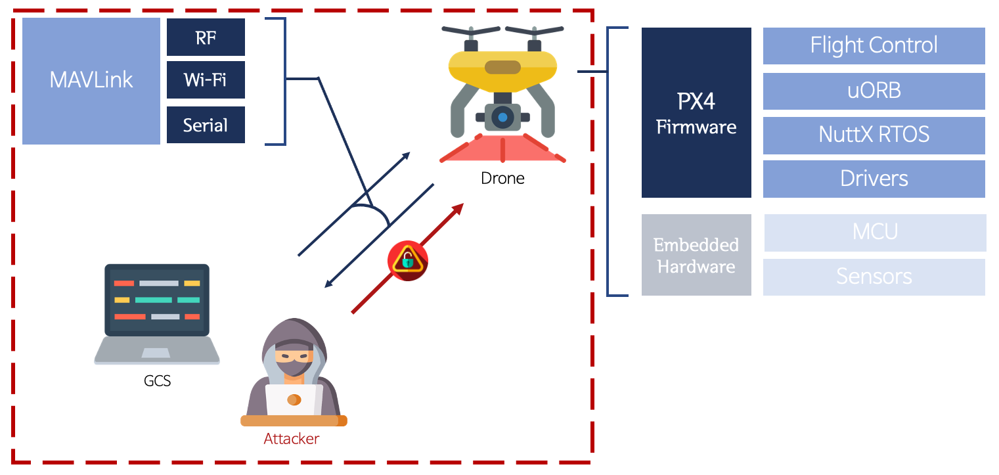

# 연구배경 및 목표 <!-- omit in toc -->

## 목차 <!-- omit in toc -->

- [1. 연구 배경](#1-연구-배경)
  - [1.1. 드론 구성요소](#11-드론-구성요소)
    - [1.1.1. 하드웨어](#111-하드웨어)
    - [1.1.2. 소프트웨어](#112-소프트웨어)
  - [1.2. 발생 가능한 피해](#12-발생-가능한-피해)
- [2. 연구 범위](#2-연구-범위)
  - [2.1. 하드웨어](#21-하드웨어)
  - [2.2. 소프트웨어](#22-소프트웨어)
- [3. 연구 목표](#3-연구-목표)
  - [3.1. Non-Compromised](#31-non-compromised)
  - [3.2. Compromised](#32-compromised)
  - [2.3. 기대성과](#23-기대성과)

- - -

## 1. 연구 배경

드론 침해 사고 시 발생할 피해를 줄이고자 취약점을 찾는 방법론을 연구

### 1.1. 드론 구성요소

#### 1.1.1. 하드웨어

**기본 구성**
```
- 드론 보드: 픽스호크는 대부분 대형/특수목적 드론에 많이 사용되며 연구에 있어서 픽스호크 4 보드를 이용
- 변속기(ESC): 변속기는 모터 회전력 제어에 사용
- 모터/프로펠러: 모터는 회전 방향이 정해져 있으며 브러시 유무에 따라 종류가 나눠짐
- 배터리: 셀의 개수에 따라 모터의 출력이 결정
- 충전기: 배터리가 없으면 모터가 작동하지 않음 배터리는 특수한 충전기를 사용
```

**비행을 위한 추가 구성**
```
- GPS & Compass: 위치 정보를 제공
- 무선조종기(Transmitter), 수신기(Receiver) 모듈: 일반적으로 2.4GHz 대역을 사용
- 원격 측정 모듈(Telemetry): 드론의 위치와 상태를 지상의 PC에 제공, 915MHz 또는 433MHz 무선 채널을 사용
- 프레임: 보드와 센서들을 고정시키는 역활
```

#### 1.1.2. 소프트웨어
```
- Operating System(OS)
  - 드론의 실행을 위한 운영체제. 픽스호크의 경우 Nuttx를 사용
- Flight controller software
  - PX4, Ardupilot 등은 이러한 비행 컨트롤러를 사용하여 이를 제어하는 플랫폼을 제공
  - 예) 비행 조종, 임무 수행, 영상 처리 등의 기능을 제공
- Ground Control Station(GCS)
  - GCS는 주로 컴퓨터에 설치되는 프로그램이며 지상에서 드론을 조종 및 운용하기 위한 솔루션
  - 예) QGroundControl, Misson Planner, APM Planner 2.0 등이 이에 해당
- Micro Air Vehicke Link(MAVLink)
  - 무인 장치와 GCS 간의 통신에 사용하는 통신 규약
```

### 1.2. 발생 가능한 피해
  - 탈취
  - 도청 및 도촬
  - 건설: 인명피해
  - 농업: 농작물 또는 경제적 피해
  - 군사: 범죄 및 테러 등


## 2. 연구 범위

드론에서 사용되는 다양한 오픈소스 및 클로즈드 소스 모두를 분석 대상으로 함

하드웨어는 해당 소프트웨어와 호환되는 기기를 선택하였음

### 2.1. 하드웨어
- 각종 계측용 센서
- RC 통신

### 2.2. 소프트웨어
- Flight controller software(PX4, Ardupilot)
- 보드 OS(Nuttx)
- GCS(QGroundControl, Mission Planner)


## 3. 연구 목표

드론 플랫폼의 보안성 향상을 위해 새로운 취약점 탐색 및 기존 위협 시나리오 검증을 목표로 함

기존 위협 시나리오는 주요 센서나 모듈 등 하드웨어를 대상으로 공격을 시도해 취약성을 검증함
  - 해당 방식은 특정한 조건 없이 외부에서 공격할 수 있기 때문에 Non-Compromised로 구분함

새로운 취약점 탐색은 드론/GCS가 장악된(Compromised) 상태로 공격을 시도해 취약성을 검증함
  - 드론을 공격할 때는 GCS가 장악된 상태를 가정
  - GCS를 공격할 때는 드론이 장악된 상태를 가정

### 3.1. Non-Compromised

*설정한 조건 없이 외부에서 공격이 가능할 때*



하드웨어 취약점이 해당되는 형태

### 3.2. Compromised

*드론의 통신 망에 접근이 가능할 때*



대부분의 소프트웨어 관련 취약점이 해당되었음

이 때 드론이 흔들리거나 추락하는 등의 안정성 문제는 배재했으며 잘못된 코딩으로 인해 발생한 취약점을 찾으려고 함


### 2.3. 기대성과
- 모의해킹 시나리오 도출
- 취약점 제보, CVE 발급
- 체크리스트 도출
- 논문 투고
- 동향 및 취약점 분석 보고서 작성

---

## 카테고리 <!-- omit in toc -->

### 소개 <!-- omit in toc -->
   1. [연구배경 및 목표](/1-intro/about-drone-research.md)
   2. [선행 연구](/1-intro/related-work.md)

### 접근 방법론 <!-- omit in toc -->
   1. [무인항공기(UAV) 소프트웨어](/2-body/1_software-uav.md)
      1. [Flight controller software](/2-body/1_software-uav.md/#1-fcsflight-controller-software)
      2. [Nuttx RTOS](/2-body/1_software-uav.md/#2-nuttx-rtos)
   2. [지상 관제(GCS) 소프트웨어](/2-body/2_software-gcs.md/)
   3. [하드웨어](/2-body/3_hardware.md)
       1. [GPS 모듈](/2-body/3_hardware.md/#1-gps-모듈)
       2. [PX4 Optical Flow](/2-body/3_hardware.md/#2-px4-optical-flow)
       3. [PX4 Telemetry Radio](/2-body/3_hardware.md/#3-px4-telemetry-radio)
       4. [Wifi 모듈](/2-body/3_hardware.md/#4-wifi-모듈)

### 결과 <!-- omit in toc -->
   1. [프로젝트 성과](/3-conclusion/result.md)
   2. [프로젝트 후기](/3-conclusion/conclusion.md)
