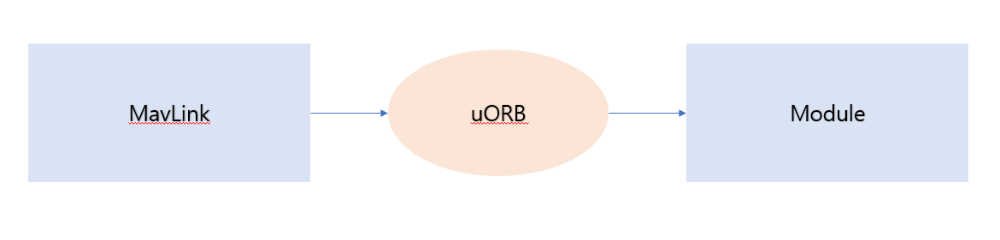
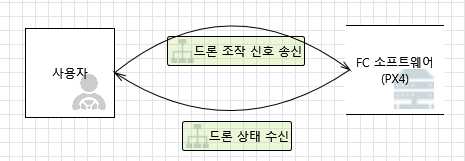
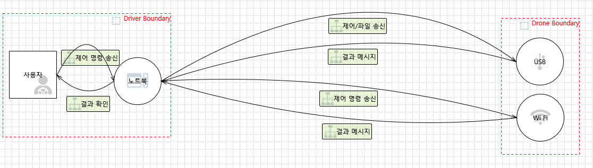
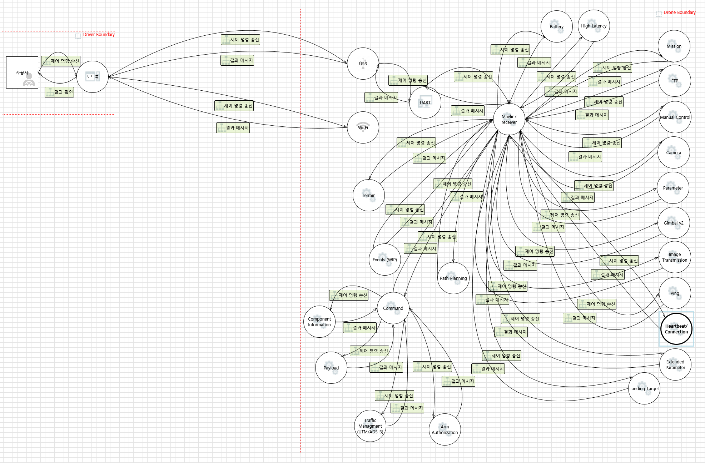
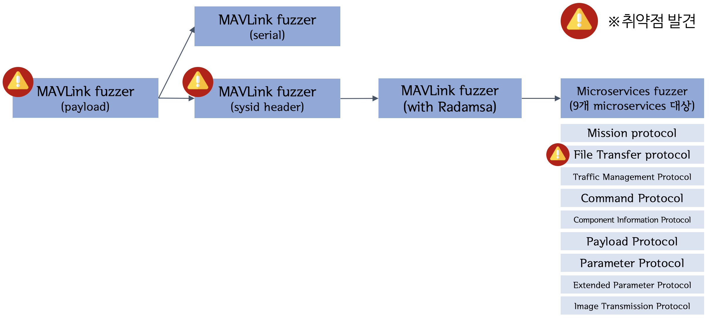
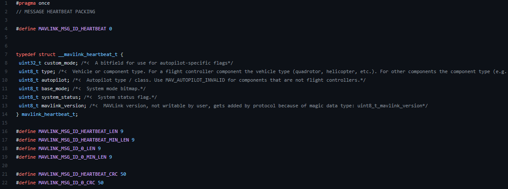

# 무인항공기(UAV) 소프트웨어  <!-- omit in toc -->

## 목차  <!-- omit in toc -->

- [1. FCS(Flight Controller Software)](#1-fcsflight-controller-software)
  - [1.1. 개요](#11-개요)
  - [1.2. PX4 / Ardupilot 구조](#12-px4--ardupilot-구조)
    - [1.2.1. MAVLink 프로토콜](#121-mavlink-프로토콜)
    - [1.2.2. uORB API](#122-uorb-api)
  - [1.3. PX4 빌드](#13-px4-빌드)
    - [1.3.1. 직접 빌드하기](#131-직접-빌드하기)
    - [1.3.2. 도커 활용하기](#132-도커-활용하기)
  - [1.4. DFD](#14-dfd)
    - [1.4.1. Level 0](#141-level-0)
    - [1.4.2. Level 1](#142-level-1)
    - [1.4.3. Level 2 (PX4 MicroServices)](#143-level-2-px4-microservices)
  - [1.5. 취약점 분석 방법론](#15-취약점-분석-방법론)
    - [1.5.1. 퍼저 개발](#151-퍼저-개발)
      - [1.5.1.1. Input Vector 설정](#1511-input-vector-설정)
      - [1.5.1.2. MAVLink Fuzzer를 위한 데이터 수집](#1512-MAVLink-Fuzzer를-위한-데이터-수집)
      - [1.5.1.3. Fuzzing 환경](#1513-fuzzing-환경)
      - [1.5.1.4. Mavlink Fuzzer](#1514-mavlink-fuzzer)
      - [1.5.1.5. Microservice Fuzzer](#1515-microservice-fuzzer)
      - [1.5.1.6. PX4 with AFL](#1516-px4-with-afl)
      - [1.5.1.7. GPS Fuzzer](#1516-gps-fuzzer)
    - [1.5.2. 시리얼 통신을 이용한 퍼징](#152-시리얼-통신을-이용한-퍼징)
  - [1.6. 참조](#16-참조)
- [2. Mavros](#2-mavros)
  - [2.1. 개요](#21-개요)
  - [2.2. 분석 환경 구축](#22-분석-환경-구축)
  - [2.3. 취약점 분석 방법론](#23-취약점-분석-방법론)

- - -

## 1. FCS(Flight Controller Software)

### 1.1. 개요

우리는 픽스호크(Pixhawk)라는 Flight Controller(FC) 를 사용한다. 픽스호크란 취미 활동은 물론 개발자를 위한
공개 하드웨어 프로젝트로, 전 세계 사용자가 이용하고 있으며 개인의 노력에 따라 높은 신뢰도를 갖춘 FC를 구현할 수 있는 시스템이다.

먼저 취약점 검증을 위해 시뮬레이터를 이용해 드론의 상태를 확인하려고 했고, 취약점이 발견됐다면 실제 드론을 이용해 교차검증을 하였음.
우리는 취약점 분석을 할 때 안전 혹은 비용적인 측면을 위해서 PX4에서 제공하는 SITL이라는 드론 시뮬레이션 환경에서 취약점 분석을 진행했고 시뮬레이션에서 발생된 취약점을 실제 드론 기기에 적용하여 취약점이 발현이 되는지 확인하는 2차 검증을 진행했다. 


### 1.2. PX4 / Ardupilot 구조

uORB라는 비동기 메시징 API를 통해 드론의 상태를 업데이트 한다.

GCS와 드론은 MAVLink 프로토콜을 이용해서 통신하고 PX4 플랫폼을 통해 MAVLink의 data 부분인 PAYLOAD를 처리하고 처리된 값을 uORB의 Topics에 Publish하고 드론은 업데이트 된 Topics 값을 Subscribe 하여 드론의 상태를 업데이트 한다. 



#### 1.2.1. MAVLink 프로토콜

MAVLink란 'Micro Air Vehicle Link'의 약어이며 소형 무인기와의 통신을 위해 만들어진
경량 통신 프로토콜(Communication Protocol) 로 안정된 데이터 교환을 제공한다.   
여러 무인 장치(UAV, Unmanned Vehicle) 과 GCS에 광범위하게 적용된다.   
이 프로토콜을 이용해 GCS를 구성할 수 있으며 이것으로 픽스호크의 모든 부분을 제어하고 정보를 얻을 수 있다.   

버전 2와 버전 1이 존재하며 하위 호환성을 갖기에 상위 버전에서 하위 버전 이용이 가능하다.   

**MAVLink v1**

6개의 헤더, 체크섬, 그리고 1개의 데이터로 이루어진다.   


**MAVLink v2**

8개의 헤더, 체크섬, 시그니처, 데이터로 이루어진다.   


구조

* Packet start marker (STX): 새 패킷 및 프로토콜 버전의 시작
* Payload length (LEN): 페이로드 길이
* Incompatibility Flags: 패킷을 처리할 수 있도록 지원해야 하는 기능을 나타내는데 사용
* Compatibility Flags: MAVLink 라이브러리가 기능을 이해하지 못하더라도 패킷을 처리하는 것을 방해하지 않음을 나타내는 데 사용
* Packet Sequence (SEQ): sequence로 패킷 손실 탐지
* SYSTEM_ID (SYS): 여러 플랫폼이 동일한 네트워크 사용 가능하게 ID 부여
* Component ID (COMP): 한 플랫폼에서 여러 component 받게 ID 부여
* Message ID (MSG): 전송되는 메시지를 식별. 페이로드 및 디코딩 방법을 정의
* DATA (PAYLOAD): 실제 전송되는 data값
* Checksum: 오류 검출을 위한 checksum 데이터
* Signature: 무결성 검증을 위한 signature

**v2와 v1의 차이점**

* 24bit 메시지 ID - 1600만 개 이상의 고유한 메시지 정의 허용(MAVLink 1은 256개로 제한됨)
* 패킷의 무결성을 검증하는 SIGNATURE 값이 추가됨
  * 하지만 PX4 에서는 SIGNATURE를 검증하는 과정이 없다. (무결성 검증을 안한다.)

#### 1.2.2. uORB API

uORB란 Micro Object Request Broker의 줄임말로 비동기식 메시징 IPC 통신 기법 중 하나이다.   
Publish-Subscribe 모델로 작동한다.   


**uORB Messaging 용어 정리**
* Node : uORB 메세지를 교환하는 주체. Process라고도 칭함.
* Topic : 두 Node간 교환하는 정보의 단위.
* Publish : 하나의 Topic에 대해서 공유하는 과정.
* Subscribe : 하나의 Topic에 대해서 요청하는 과정.
* Advertise : 처음 Publish할 때 Master Node에게 부탁하게 되는데, 이 과정을 Advertising 이라고 함.

```예) MAVLink의 msgID에 따른 PAYLOAD의 값을 연산하고 Publish를 하여 Topics에 올리고 모듈은 Topics에 publish된 값을 Subscribe를 하여 uORB 값을 업데이트 한다.```


### 1.3. PX4 빌드

#### 1.3.1. 직접 빌드하기

**PX4 다운로드**

다음 명령어를 통해 PX4 소스 코드를 다운 받을 수 있다.   
```
$ git clone https://github.com/PX4/PX4-Autopilot.git --recursive
```

시뮬레이터를 실행하려면 아래 스크립트로 실행 환경을 사전에 설치해야 한다.   
jdk, 파이썬 등이 설치되어 있어야 한다.   
```
$ bash ./PX4-Autopilot/Tools/setup/ubuntu.sh
```

이후 원하는 시뮬레이터를 지정해서 make를 진행한다.   
시뮬레이터는 jMAVSim, Gazebo 등이 있으며 공식 문서는 Gazebo를 추천한다.   
```
Start JMavSim with Address Sanitizer(default vehicle model)
$ make px4_sitl jmavsim PX4_BUILD_TYPE=0 PX4_ASAN=1
```

#### 1.3.2. 도커 활용하기

PX4는 개발 환경이 모두 세팅된 pre-built 컨테이너가 제공된다. [제공되는 컨테이너](https://github.com/PX4/PX4-containers/blob/master/README.md#container-hierarchy) 를 이용하면 손쉽게 퍼징 시도가 가능하다.   

먼저 아래 명령어로 도커를 설치해야 한다.   
다음으로 권한을 설정하는 명령어를 실행한다.   
```
$ curl -fsSL get.docker.com -o get-docker.sh
$ sudo sh get-docker.sh

Create docker group (may not be required)
$ sudo groupadd docker
Add your user to the docker group.
$ sudo usermod -aG docker $USER
```

아래 명령어로 호스트 컴퓨터에서 소스코드를 다운로드 받는다.   
```
$ mkdir src
$ cd src
$ git clone https://github.com/PX4/PX4-Autopilot.git
$ cd PX4-Autopilot
```

컨테이너를 이용할 수 있도록 제공되는 스크립트를 이용해 PX4를 실행한다.   
또는 bash 옵션으로 직접 명령줄을 이용할 수 있다.   
```
build SITL
$ ./Tools/docker_run.sh 'make px4_sitl_default'

start a bash session
$ ./Tools/docker_run.sh 'bash'
```

우리는 퍼징을 위해 미리 만들어둔 도커 파일을 제공하려 하고 있다.   
자세한 정보는 [이곳](../README.md) 참조

### 1.4. DFD

#### 1.4.1. Level 0
레벨 0은 FCS와 사용자의 주요 데이터 흐름을 간략히 나타낸다.   



#### 1.4.2. Level 1
레벨 1은 드론과 GCS로 영역을 구분하여 구성한다.   
드론 부분은 취약점 분석에 이용했던 포트만 나타낸다.   



#### 1.4.3. Level 2 (PX4 MicroServices)
레벨 2 서비스 버전은 PX4 내부에서 마이크로서비스가 어떻게 처리되는지 정리한다.   

해당 부분들을 모두 분석했으며 이 부분을 표적으로 하는 새로운 퍼저를 개발했다.   




### 1.5. 취약점 분석 방법론

#### 1.5.1. 퍼저 개발

PX4 소스코드 오디팅 등 분석을 하면서 퍼저를 발전시켰고, 뮤테이션 시키는 범위를 늘리거나 프로토콜에 맞게 퍼징을 하도록 했다.   

이런 방식으로 업그레이드 됨에 따라 추가적인 취약점이 발견됐다.   



##### 1.5.1.1 Input Vector 설정
드론의 상태를 처리할 때 사용되는 Input 값은 MAVLink Protocol이다. MAVLink Protocol MSG_ID 별로 드론의 상태를 처리하고 MSG_ID에 따라 Protocol의 구조에서 PAYLOAD 부분의 최대 최소 길이와 값의 구성이 달라진다.

##### 1.5.1.2 MAVLink Fuzzer를 위한 데이터 수집
[MAVLink github](https://github.com/mavlink/c_library_v2)를 확인해보면 아래 사진과 같이 "MSG_ID"와 CRC 값을 계산 할 때 MSG_ID을 구분하기 위해 추가 되는 "EXTRA_CRC" 값과 PAYLOAD의 "최대 길이", "최소 길이"가 정의 되어있다. 우리는 이 값을 모두 파싱하여 Fuzzer 개발에 사용했다. MSG_ID에 따른 추가 정보는 [MAVLink guide 페이지](https://mavlink.io/en/messages/common.html)를 참고했다.


##### 1.5.1.3 Fuzzing 환경
MAVLink Protocol을 처리하는 함수를 찾기 위해 소스코드 오디팅을 한 결과 [PX4의 mavlink_main.cpp](https://github.com/PX4/PX4-Autopilot/blob/master/src/modules/mavlink/mavlink_main.cpp)를 거쳐 [mavlink_receiver.cpp](https://github.com/PX4/PX4-Autopilot/blob/master/src/modules/mavlink/mavlink_receiver.cpp#L115)에 접근해 case 구문을 통해 MSG_ID 별로 패킷을 처리하는 것을 확인했다. 추가적으로 PX4에서는 SITL 이라는 가상 드론 simulation이 존재했고 아래 사진과 같은 형태로 작동이 되는 것을 확인했다. 이 SITL은 MAVLink Protocol을 처리하는 "mavlink_main.cpp"에 MAVLink Packet을 UDP를 통해 18570 포트로 전송할 수 있는 것을 확인할 수 있다. 그래서 우리는 SILT을 통해 mavlink_main.cpp -> mavlink_receiver.cpp를 타겟으로 퍼징을 진행했다.


##### 1.5.1.4 Mavlink Fuzzer

* Mavlink 패킷 구조를 충족시켜 커버리지를 높임.
* checksum 자동 계산 (Crcc16Mcrf4xx 사용)
* msgid 별 최대, 최소 길이 충족 (1.5.1.2에서 파싱한 데이터 사용)
* Crash 발생시 자동 감지
* 뮤테이션 가능 패킷 필드와 뮤테이션 불가능 패킷 필드 구분.
  - 이유: 패킷 전체를 대상으로 뮤테이션을 진행했을 때 패킷의 형태가 깨지게 되어 패킷이 핸들러 함수에 도달하지 않는다.
  - 뮤테이션 가능 부분 : sysid, compid, payload

  

* [4D Fuzzer](https://github.com/BOB4Drone/4D-Fuzzer)

##### 1.5.1.5 Microservice Fuzzer

* 기존의 Mavlink 프로토콜보다 상호작용을 쉽게 하기 위해 상위 프로토콜인 Microservice 추가
* 기존의 Mavlink 프로토콜보다 많은 상호작용 요구
  * EX) FTP 프로토콜을 통한 파일 작성시 FTP 프로토콜의 상호 작용
  
  

* 따라서 패킷을 보내는 순서, 내용을 더 세부적으로 맞춰줘야함
* PX4에서 사용하는 Microservice를 분류, 각각의 Microservice 분석, 퍼저 개발

  |Mission|FTP|Traffic Management|Command|Component Information|payload|parameter|Extend parameter|Image Trasmission|
  |-------|---|------------------|-------|---------------------|-------|---------|----------------|-----------------|

* [4D Fuzzer](https://github.com/BOB4Drone/4D-Fuzzer)


#### 1.5.1.6 PX4 with AFL

##### Network를 이용한 AFL 퍼징 시도

* AFL을 통해 뮤테이션한 부분을 Mavlink 패킷의 형태로 만들어 보내주는 방법 고안


* MSGID별로 Mavlink 패킷 양식이 달라 MSGID별 별도 퍼징 필요 -> 많은 자원 소모

* PX4 부팅 속도가 너무 느려 비효율적

* 따라서 위에서 개발한 4Dfuzzer가 더 효율적이라 판단.

##### Harness를 이용한 AFL 퍼징 시도

* 속도향상을 위해 Harness를 이용해 Mavlink 핸들링 부분만 가져와 퍼징 시도

* PX4 컴파일 구조 파악 (module file -> library -> 하나의 binary로 링킹)


* 원하는 핸들러 기능을 가진 Harness를 만들어 주었지만 다른 모듈과 상호작용하는 요소들이 많아 종속성을 만족시켜주지 못해 실패함.

#### 1.5.1.7 GPS Fuzzer

* PX4에서 default로 gps를 받는 프로토콜인 UBX 프로토콜을 대상으로 진행했다.
    ```
    case gps_driver_mode_t::UBX:
		_helper = new GPSDriverUBX(_interface, &GPS::callback, this, &_report_gps_pos, _p_report_sat_info,gps_ubx_dynmodel, heading_offset, ubx_mode);
		set_device_type(DRV_GPS_DEVTYPE_UBX);
		break;
    ```

* 먼저 UBX 프로토콜 구조를 파악했다

    

* GPS 모듈을 통해서 입력을 받아야 하므로 직접 패킷을 생성해서 보내주기 힘들었다.

* 따라서 입력되는 GPS 값을 뮤테이션해주는 퍼징 모듈을 제작하였다.

    뮤테이션 코드
    ```
    void input_checksum(uint8_t data){
        ck_a = (ck_a + data) & 0xff;
        ck_b = (ck_b + ck_a) & 0xff;
    }

    void mutation(uint8_t* data, int size){
        int i;
        /*mutate payload*/
        srand((unsigned int)time(NULL));
        for(i = 0; i < size; i++){
                if(data[i] == 0xb5 && data[i+1] == 0x62){
                        packet_size = data[i+4];
                        cur_size = 0;
                        ck_a = 0;
                        ck_b = 0;
                        for (int k = i+2; k < i+6; k++){
                                input_checksum(data[k]);
                        }
                        i += 5;
                }
                else if(cur_size == packet_size){
                        data[i] = ck_a;
                        data[i+1] = ck_b;
                        i += 1;
                }
                else{
                        cur_size++;
                        uint8_t rand_byte = rand() % 0xff;
                        data[i] = rand_byte;
                        input_checksum(data[i]);
                }
        }

    }
    ```
    
    퍼징 모듈 코드 - 모듈 실행시 전역변수를 True로 만들어 퍼징 진행했다.
    ```
    #include <px4_platform_common/log.h>
    #include <px4_platform_common/my.h>
    bool fuzz;
    u_int8_t ck_a;
    u_int8_t ck_b;
    int packet_size;
    int cur_size;
    __EXPORT int fuzz_test_main(int argc, char *argv[]);
    int fuzz_test_main(int argc, char *argv[])
    {
        fuzz = true;
        PX4_INFO("fuzzing start!");
        return OK;
    }
    ```
    
    * 해당 퍼징 모듈을 실행한 결과 뮤테이션된 gps 값들이 정상적으로 들어오는 것을 확인할 수 있었다.
    
        

#### 1.5.3. 시리얼 통신을 이용한 퍼징

시뮬레이터 퍼징에서 나왔던 취약점을 테스트 하려면 실제 기기를 이용해야 했다.
이를 이용하면 실제 기기에서 작동되는지 확인할 수 있다.
통신 속도는 USB 연결 시 115,000로 설정해서 진행하면 된다.
UDP와 시리얼의 통신 속도를 비교한 결과 평균적으로 약 4초 가의 차이로 UDP가 더 빠른걸 확인했다.

**사용 방법**

이미지 다운로드
```
$ docker pull ashinedo/4-drone:PX4-1.0
```

이미지 실행  
취약점이 검출됐던 PX4 버전이 설치되며 퍼저가 자동으로 실행된다.
```
$ docker run -it --rm ashinedo/4-drone:PX4-1.0
```

만약 자동으로 퍼저가 실행되지 않기를 바란다면 bash 옵션을 통해 직접 명령어를 입력할 수 있다.
```
$ docker run -it --rm ashinedo/4-drone:PX4-1.0 bash
```

도커 이미지들은 많은 용량을 차지하므로 이용 후 제거
```
로컬 이미지 리스팅
$ docker images

태그를 이용해 로컬 이미지 제거
$ docker rmi ashinedo/4-drone:PX4-1.0
```

배포중인 Docker Image

**[PX4-1.0](https://hub.docker.com/layers/178199113/ashinedo/4-drone/PX4-1.0/images/sha256-c1623af96905cf568545083de81363e87fcd66dd38b717dae300b5e84184c711?context=repo)** - MAVLink fuzzer(sysid header)

### 1.6. 참조

* https://mavlink.io/en/
* https://docs.px4.io/master/ko/
* https://nxp.gitbook.io/hovergames/developerguide/px4-tutorial-example-code/hg-px4-example-lab-1


## 2. MAVROS

### 2.1. 개요
MAVROS란 ROS를 실행하는 시스템 간에 MAVLink 확장 가능 통신을 실행하는 패키지이다. 주로 [Mission Computer]()를 사용할때 mavros를 사용한다.

### 2.2. 분석 환경 구축
```
mkdir -p ~/catkin_ws/src
cd ~/catkin_ws
catkin init
wstool init src
```
```
sudo apt-get install python-catkin-tools python-rosinstall-generator -y
```
```
rosinstall_generator --rosdistro kinetic mavlink | tee /tmp/mavros.rosinstall
```
```
wstool merge -t src /tmp/mavros.rosinstall
wstool update -t src -j4
rosdep install --from-paths src --ignore-src -y
```
```
./src/mavros/mavros/scripts/install_geographiclib_datasets.sh
```
`~/catkin_ws/src/mavros/libmavconn/cmake/Modules/~/catkin_ws/src/mavros/libmavconn/cmake/Modules`에서 아래와 같이 변경   
```
# This module enables C++11 or C++14 support
# 
# thanks for: http://www.guyrutenberg.com/2014/01/05/enabling-c11-c0x-in-cmake/

include(CheckCXXCompilerFlag)

check_cxx_compiler_flag("-std=c++14" COMPILER_SUPPORTS_STD_CXX14)
if (NOT COMPILER_SUPPORTS_STD_CXX14)
  check_cxx_compiler_flag("-std=c++11" COMPILER_SUPPORTS_STD_CXX11)
endif ()

if (COMPILER_SUPPORTS_STD_CXX14)
  set(CMAKE_CXX_FLAGS "${CMAKE_CXX_FLAGS} -fsanitize=address -std=c++14")
elseif (COMPILER_SUPPORTS_STD_CXX11)
  set(CMAKE_CXX_FLAGS "${CMAKE_CXX_FLAGS} -fsanitize=address -std=c++11")
else ()
  message(FATAL_ERROR "The compiler ${CMAKE_CXX_COMPILER} has no C++11 support. Please use a different C++ compiler.")
endif ()
```
```
cd ~/catkin_ws
catkin build
source devel/setup.bash
```
### 2.3. 취약점 분석 방법론

#### 2.3.1. Fuzzing을 통한 취약점 분석
MAVROS역시 PX4와 동일하게 mavlink protocol을 사용하기 때문에 우리가 개발한 [4dfuzzer]()로 취약점을 찾을 수 있었다.

## 카테고리 <!-- omit in toc -->

### 소개 <!-- omit in toc -->
   1. [연구배경 및 목표](/1-intro/about-drone-research.md)
   2. [선행 연구](/1-intro/related-work.md)

### 접근 방법론 <!-- omit in toc -->
   1. [무인항공기(UAV) 소프트웨어](/2-body/1_software-uav.md)
      1. [Flight controller software](/2-body/1_software-uav.md/#1-fcsflight-controller-software)
      2. [Nuttx RTOS](/2-body/1_software-uav.md/#2-nuttx-rtos)
   2. [지상 관제(GCS) 소프트웨어](/2-body/2_software-gcs.md/)
   3. [하드웨어](/2-body/3_hardware.md)
       1. [GPS 모듈](/2-body/3_hardware.md/#1-gps-모듈)
       2. [PX4 Optical Flow](/2-body/3_hardware.md/#2-px4-optical-flow)
       3. [PX4 Telemetry Radio](/2-body/3_hardware.md/#3-px4-telemetry-radio)
       4. [Wifi 모듈](/2-body/3_hardware.md/#4-wifi-모듈)

### 결과 <!-- omit in toc -->
   1. [프로젝트 성과](/3-conclusion/result.md)
   2. [프로젝트 후기](/3-conclusion/conclusion.md)
